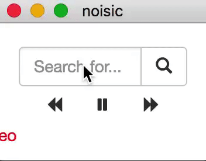

# noisic

Simple YouTube client of electron for trend music.



## Usage

### run

```
electron .
```

### packaging

```
electron-packager . noisic --platform=darwin --arch=x64 --icon=icon/icons8-handball-filled-100.icns --version=1.0.0
```

## Dependencies

[electron-quick-start](https://github.com/electron/electron-quick-start)
